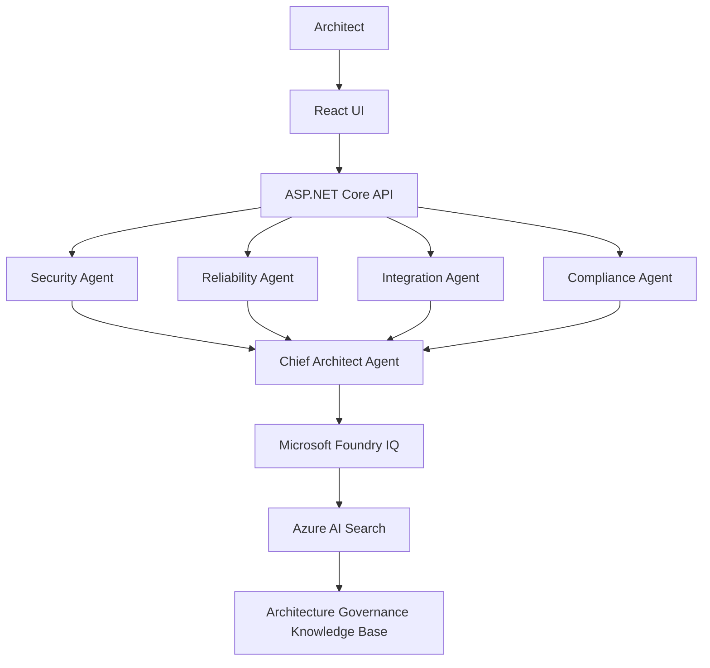
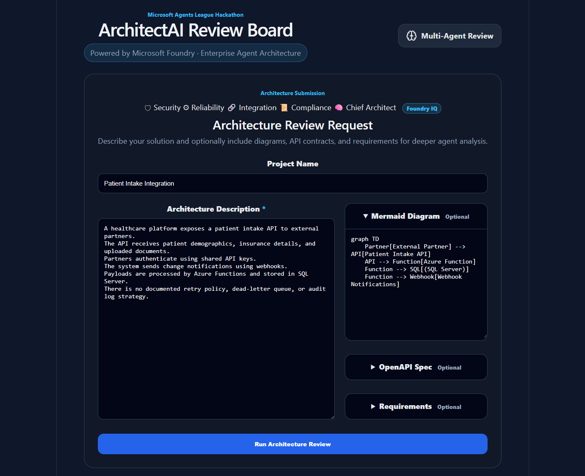
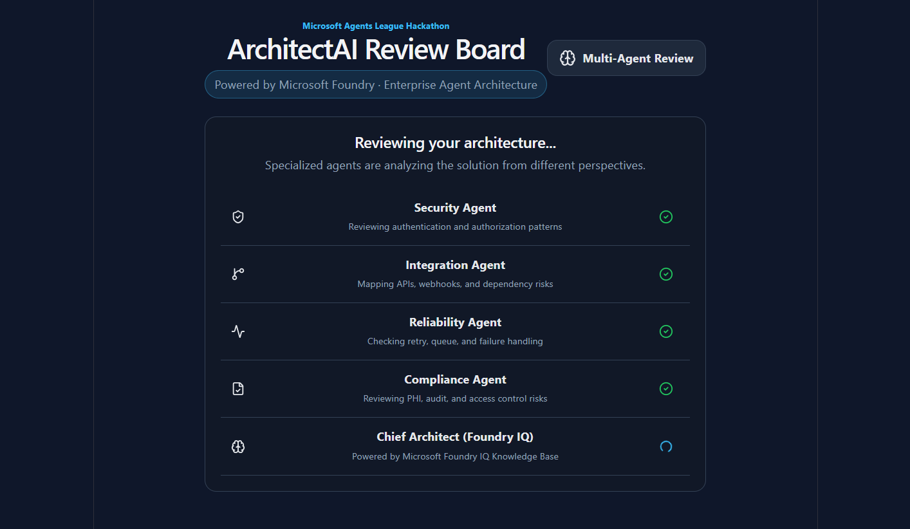
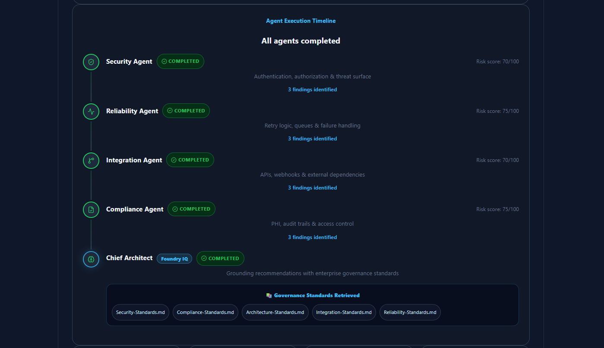
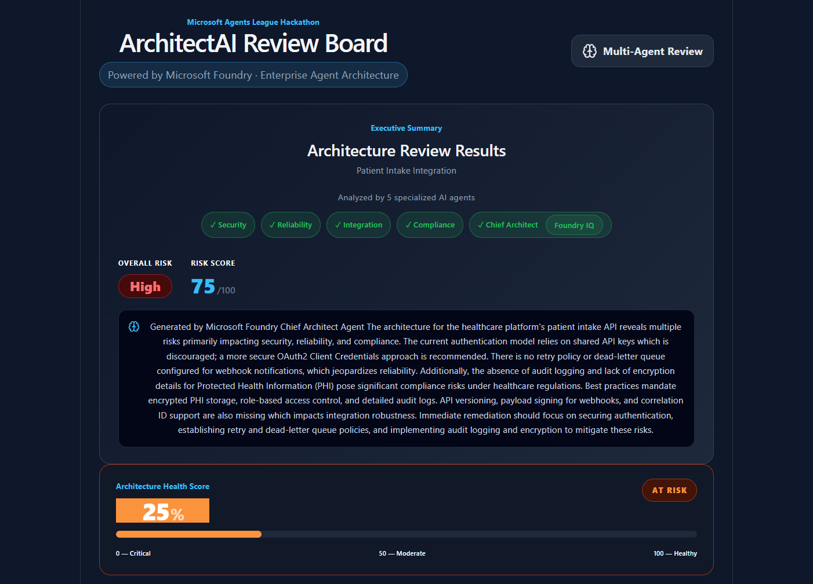
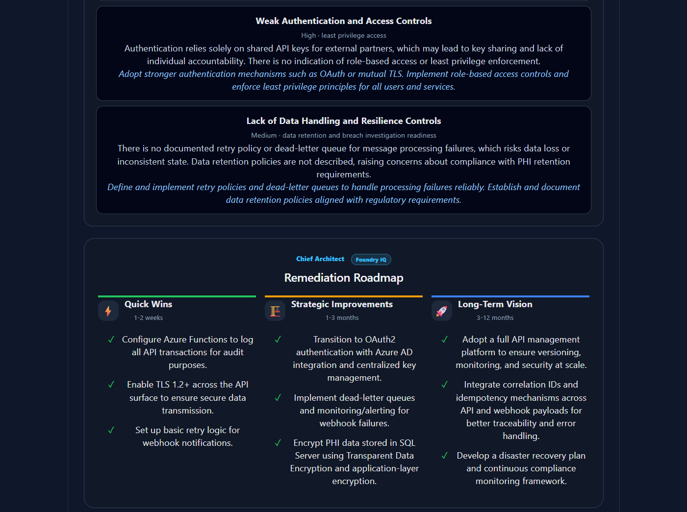
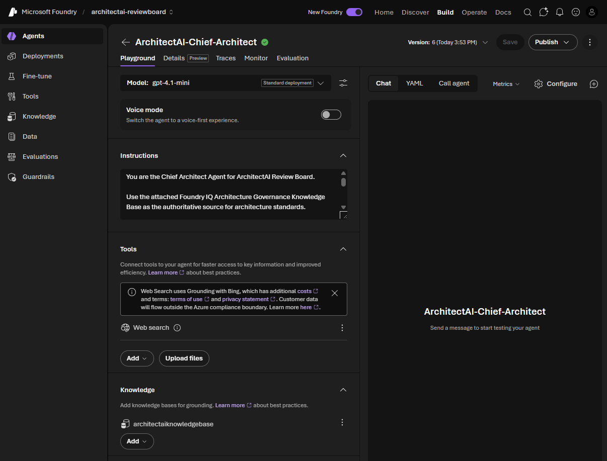
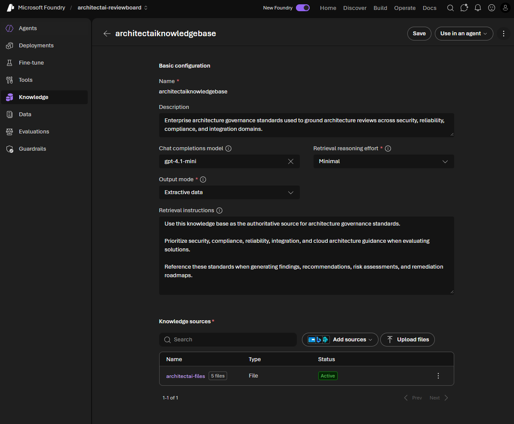

# ArchitectAI Review Board

> **Multi-Agent Architecture Intelligence Grounded by Microsoft Foundry IQ**
> 
> Built on .NET 10, Azure OpenAI, Microsoft AI Foundry Agent Runtime, Azure AI Search, and Microsoft Foundry IQ
---

## Overview

**ArchitectAI Review Board** is a multi-agent AI solution that performs deep automated reviews of software architecture submissions. A panel of five specialized AI agents analyzes a submitted architecture description, Mermaid diagram, OpenAPI spec, and requirements in parallel, then consolidates findings into an executive-level review report.

The system was built for the **Microsoft Agents League Hackathon** and demonstrates an enterprise-grade agent orchestration pattern using Azure OpenAI (GPT-4.1-mini), Azure AI Foundry, and **Microsoft Foundry IQ Integration** — providing knowledge grounding through an Architecture Governance Knowledge Base backed by Azure AI Search and Azure OpenAI text-embedding-3-small.

## Example Scenarios

ArchitectAI Review Board includes sample architecture review scenarios that demonstrate different governance outcomes and risk profiles.

| Scenario | Expected Risk | Expected Health Score | Description |
|-----------|-----------|-----------|-----------|
| [Legacy Healthcare Integration Platform](docs/examples/scenario-01-critical-legacy-platform.md) | High | 10-15% | Legacy integration platform with significant security, compliance, and reliability gaps. |
| [Enterprise Patient Data Exchange Platform](docs/examples/scenario-03-enterprise-patient-exchange.md) | Medium | 40-45% | Balanced enterprise architecture with realistic governance findings. |
| [Modern Healthcare Integration Platform](docs/examples/scenario-02-modern-cloud-platform.md) | Low | 80-85% | Cloud-native architecture implementing modern security and reliability practices. |

## Key Features

- Multi-Agent Architecture Review
- Microsoft Foundry Agent Runtime Integration
- Microsoft Foundry IQ Knowledge Grounding
- Architecture Governance Knowledge Base
- Executive Architecture Assessment
- Architecture Health Score
- Governance Roadmap Generation
- Mermaid Diagram Analysis
- OpenAPI Specification Review
- PDF Report Export
- Explainable Recommendations with Retrieved Sources

### Microsoft Foundry IQ Integration

ArchitectAI Review Board leverages Microsoft Foundry IQ to ground architecture reviews against an enterprise Architecture Governance Knowledge Base backed by Azure AI Search.

Knowledge documents are vectorized using Azure OpenAI text-embedding-3-small and indexed in Azure AI Search, enabling semantic retrieval of governance standards during architecture reviews.

The Chief Architect Agent retrieves governance standards covering security, reliability, compliance, integration, and architecture best practices and incorporates them into executive assessments, risk prioritization, recommendations, and governance roadmaps.

Retrieved governance sources include:

- Security Standards
- Reliability Standards
- Compliance Standards
- Integration Standards
- Architecture Standards

By grounding recommendations against enterprise governance standards, ArchitectAI delivers explainable, traceable, and standards-based architecture guidance rather than relying solely on model knowledge.

---

## Solution Structure

```
ArchitectAI/               # ASP.NET Core Web API (.NET 10)
│
├── Commands/
│   └── ArchitectureReviewOrchestrator.cs   # Parallel agent runner + result consolidation
│
├── Configuration/
│   ├── AzureOpenAISettings.cs              # Azure OpenAI connection settings
│   └── FoundrySettings.cs                  # Azure AI Foundry project settings
│
├── Controllers/
│   └── ArchitectureReviewController.cs     # POST /api/ArchitectureReview endpoint
│
├── DTO/
│   └── ChiefArchitectReviewResult.cs       # Chief Architect consolidated output shape
│
├── Interfaces/
│   ├── IArchitectureAgent.cs               # Agent contract
│   └── IChiefArchitectAgentService.cs      # Chief Architect agent contract
│
├── Models/
│   ├── RequestModel.cs                     # ArchitectureReviewRequest
│   └── Models.cs                           # ArchitectureReviewResult, AgentReviewResult, Finding, etc.
│
├── Services/
│   ├── SecurityAgentService.cs             # Security review agent (Azure OpenAI)
│   ├── IntegrationAgentService.cs          # Integration review agent (Azure OpenAI)
│   ├── ReliabilityAgentService.cs          # Reliability review agent (Azure OpenAI)
│   ├── ComplianceAgentService.cs           # Compliance review agent (Azure OpenAI)
│   └── ChiefArchitectFoundryAgentService.cs # Chief Architect agent (Azure AI Foundry)
│
└── appsettings.json                        # Azure OpenAI + Foundry configuration

architectai-web/           # React 19 SPA (Vite)
│
├── src/
│   ├── App.jsx             # Main app: form, progress screen, results dashboard
│   └── App.css             # Styles
│
└── package.json
```

---

## Architecture


---

Each specialist agent runs against **Azure OpenAI (GPT-4.1-mini)** in parallel via `Task.WhenAll`. The Chief Architect agent runs on **Azure AI Foundry** via **Microsoft Foundry IQ Integration**, using a pre-configured named agent (`ArchitectAI-ReviewBoard-Agent`) that consolidates all specialist findings into the final executive report. Foundry IQ provides the intelligent routing and context management layer that coordinates agent interactions and ensures coherent cross-agent reasoning.

The Architecture Governance Knowledge Base is indexed using **Azure AI Search** and **Azure OpenAI text-embedding-3-small** embeddings. During execution, **Microsoft Foundry IQ** performs semantic retrieval against the indexed governance standards and provides grounded context to the Chief Architect Agent.

---
## Why It Matters

Traditional architecture reviews are often manual, subjective, and difficult to scale across multiple teams and projects.

ArchitectAI Review Board combines specialized AI agents with Microsoft Foundry IQ knowledge grounding to provide explainable, standards-based architecture governance.

This enables organizations to identify risks earlier, improve governance consistency, reduce implementation rework, and accelerate architectural decision-making.

---

## Agents

| Agent | Focus Area | Transport |
|---|---|---|
| **Security Agent** | Authentication, authorization, threat surface, credential risks | Azure OpenAI |
| **Integration Agent** | APIs, webhooks, event contracts, versioning, partner dependencies | Azure OpenAI |
| **Reliability Agent** | Retry policies, dead-letter queues, failure recovery, observability | Azure OpenAI |
| **Compliance Agent** | HIPAA-style safeguards, PHI/PII handling, audit logs, encryption | Azure OpenAI |
| **Chief Architect Agent** | Consolidates all findings → executive summary, roadmap, recommendations | Azure AI Foundry + Microsoft Foundry IQ |

Each specialist agent returns:
```json
{
  "agentName": "Security Agent",
  "riskScore": 72,
  "findings": [
	{
	  "title": "Shared API key authentication",
	  "severity": "High",
	  "description": "...",
	  "recommendation": "..."
	}
  ]
}
```

The Chief Architect consolidates into:
```json
{
  "summary": "...",
  "overallRisk": "Medium",
  "overallScore": 68,
  "topRisks": [...],
  "recommendedActions": [...],
  "knowledgeSources": [...],
  "roadmap": {
	"quickWins": [...],
	"strategicImprovements": [...],
	"longTermVision": [...]
  }
}
```

---

## API

### `POST /api/ArchitectureReview`

Submits an architecture for multi-agent review.

**Request body:**
```json
{
  "projectName": "Patient Intake Integration",
  "architectureDescription": "A healthcare platform exposes...",
  "mermaidDiagram": "graph TD\n  Partner --> API\n  API --> Function\n  Function --> SQL",
  "openApiSpec": "",
  "requirements": ""
}
```

`mermaidDiagram`, `openApiSpec`, and `requirements` are optional but improve analysis quality.

**Response:** `ArchitectureReviewResult` — see [Models](#models).

---

## Frontend

The React SPA (`architectai-web`) provides three screens:

| Screen | Description |
|---|---|
| **Input form** | Project name, architecture description, optional Mermaid diagram, OpenAPI spec, and requirements |
| **Progress screen** | Live agent execution timeline showing each agent's status (pending → running → completed) |
| **Results dashboard** | Overall risk score, per-agent findings, top risks, recommended actions, and roadmap |

Additional features:
- Mermaid diagram rendering
- PDF export of the review report via `jsPDF` + `html2canvas`

**Key dependencies:**

| Package | Purpose |
|---|---|
| React 19 | UI framework |
| Vite 8 | Build tooling |
| Mermaid 11 | Architecture diagram rendering |
| Lucide React | Icons |
| jsPDF + html2canvas | PDF export |
| ReactFlow | (Available) Flow diagram support |

---

## Prerequisites

- [.NET 10 SDK](https://dotnet.microsoft.com/download/dotnet/10.0)
- [Node.js 20+](https://nodejs.org/)
- An **Azure AI Services** resource with:
  - Azure OpenAI deployment (`gpt-4.1-mini` or equivalent)
  - Azure AI Foundry project with a configured agent named `ArchitectAI-ReviewBoard-Agent`

---

## Configuration

### Backend — `ArchitectAI/appsettings.json`

```json
{
  "AzureOpenAI": {
	"Endpoint": "https://<your-resource>.services.ai.azure.com/",
	"ApiKey": "<your-api-key>",
	"DeploymentName": "gpt-4.1-mini"
  },
  "Foundry": {
	"Endpoint": "https://<your-resource>.services.ai.azure.com/api/projects/<your-project>",
	"AgentName": "ArchitectAI-ReviewBoard-Agent",
	"AgentVersion": "7"
  }
}
```

> **Note:** Do not commit real API keys. Use [User Secrets](https://learn.microsoft.com/aspnet/core/security/app-secrets) or environment variables in production.

### Frontend — `architectai-web/src/App.jsx`

The API base URL is defined at the top of `App.jsx`:

```js
const API_URL = "https://localhost:7110/api/ArchitectureReview";
```

Update this to your deployed backend URL when deploying.

---

## Screenshots

### Architecture Submission Workspace


### Multi-Agent Review Execution


### Foundry IQ Grounding


### Executive Architecture Assessment


### Recommendations & Governance Roadmap


### Azure Foundry Agent


### Azure Foundry Knowledge

---

## Running Locally

### 1. Backend

```powershell
cd ArchitectAI
dotnet restore
dotnet run
```

API will be available at:
- `https://localhost:7110` (HTTPS)
- `http://localhost:5050` (HTTP)

Swagger UI: `https://localhost:7110/swagger`

### 2. Frontend

```powershell
cd architectai-web
npm install
npm run dev
```

Frontend will be available at: `http://localhost:5173`

---

## NuGet Packages

| Package | Version | Purpose |
|---|---|---|
| `Azure.AI.OpenAI` | 2.2.0 | Azure OpenAI client for specialist agents |
| `Azure.AI.Projects` | 2.1.0-beta.2 | Azure AI Foundry project client + Microsoft Foundry IQ Integration for Chief Architect agent |
| `Azure.Identity` | 1.21.0 | DefaultAzureCredential for Foundry authentication |
| `Microsoft.Extensions.AI` | 10.7.0 | AI abstractions |
| `Swashbuckle.AspNetCore` | 10.2.1 | Swagger / OpenAPI docs |

> **Important:** `Azure.AI.OpenAI 2.2.0` is required to match the `OpenAI` base package version (`2.9.x`) pulled transitively by `Azure.AI.Projects`. Using `Azure.AI.OpenAI 2.1.0` causes a `MissingMethodException` at runtime on `ChatCompletionOptions.SerializedAdditionalRawData`.

---

## Models

```
ArchitectureReviewResult
├── ReviewId            string
├── ProjectName         string
├── OverallRisk         string          (Low | Medium | High | Critical)
├── OverallScore        int             (0–100)
├── Summary             string
├── Agents              AgentReviewResult[]
│   ├── AgentName       string
│   ├── RiskScore       int
│   ├── FindingsCount   int
│   └── Findings        Finding[]
│       ├── Title       string
│       ├── Severity    string
│       ├── Description string
│       └── Recommendation string
├── KnowledgeSources    string[]
│   ├── Security-Standards.md
│   ├── Reliability-Standards.md
│   ├── Compliance-Standards.md
│   ├── Architecture-Standards.md
│   └── Integration-Standards.md
├── TopRisks            TopRisk[]
├── RecommendedActions  RecommendedAction[]
└── Roadmap             ArchitectureRoadmap
	├── QuickWins               string[]
	├── StrategicImprovements   string[]
	└── LongTermVision          string[]
```

---

## CORS

The backend allows cross-origin requests from `http://localhost:5173` (the Vite dev server). Update the CORS policy in `Program.cs` for production deployments.

```csharp
policy.WithOrigins("http://localhost:5173")
	  .AllowAnyHeader()
	  .AllowAnyMethod();
```
## Microsoft Agents League Hackathon

ArchitectAI Review Board was built for the Microsoft Agents League Hackathon under the Reasoning Agents track.

The solution combines:

- Microsoft Foundry Agent Runtime
- Microsoft Foundry IQ
- Azure AI Search
- Azure OpenAI GPT-4.1
- Azure OpenAI text-embedding-3-small
- Multi-Agent Orchestration

to deliver grounded architecture governance recommendations and explainable decision support for engineering teams.
