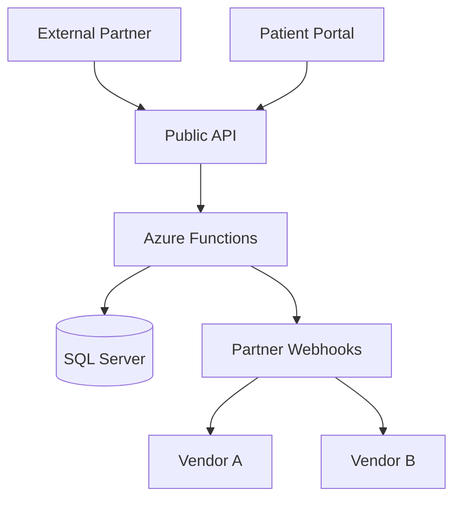

# Scenario 01 - Critical Legacy Healthcare Integration Platform

## Project Name

Legacy Healthcare Integration Platform

## Architecture Description

A healthcare organization exposes a patient intake API directly to external partners over HTTPS.

Authentication is implemented using shared API keys stored in application configuration files. The API receives patient demographics, insurance information, and uploaded medical documents containing PHI.

Incoming requests are processed synchronously by Azure Functions and stored in SQL Server. Secrets are stored in application settings and Azure Key Vault is not used.

Webhook notifications are sent to external systems without payload signing, verification, or idempotency controls. Correlation IDs are not implemented across requests and APIs are not versioned.

The platform does not implement retry policies, dead-letter queues, health checks, centralized monitoring, or distributed tracing. Audit logging only captures application errors and does not record user activity or access to patient information.

There is no documented disaster recovery strategy, backup validation process, or environment isolation between Development, QA, and Production.

The organization plans to onboard additional healthcare partners and external vendors over the next 12 months.

## Mermaid Diagram

## Expected Review Outcome

### Overall Assessment

| Metric | Expected Value |
|----------|----------|
| Overall Risk | Higth |
| Architecture Health Score | 10-15% |
| Architecture Health | Critical |

     