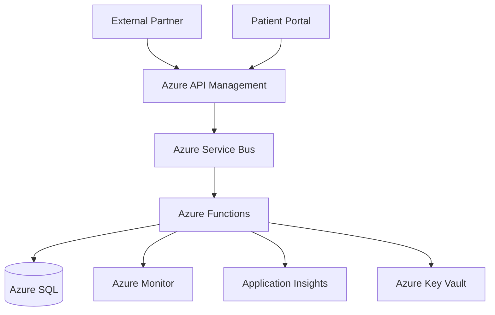

 
# Scenario 02 - Modern Cloud Healthcare Platform

## Project Name

Modern Healthcare Integration Platform

## Architecture Description

A healthcare organization exposes APIs through Azure API Management using OAuth 2.0 Client Credentials authentication.

All secrets and certificates are stored in Azure Key Vault and accessed through managed identities.

Requests are processed asynchronously through Azure Service Bus queues and Azure Functions. Dead-letter queues are configured for failed processing and retry policies use exponential backoff.

Patient data is encrypted in transit and at rest. Audit logging captures user activity, PHI access, and administrative actions. Logs are centralized in Application Insights and Azure Monitor.

Webhook notifications use payload signing, idempotency keys, API versioning, and correlation IDs.

The platform includes health checks, distributed tracing, automated backups, disaster recovery procedures, and strict environment isolation between Development, QA, and Production.

The solution is expected to onboard multiple healthcare partners and process high transaction volumes while maintaining HIPAA compliance.

## Mermaid Diagram

## Expected Review Outcome

### Overall Assessment

| Metric | Expected Value |
|----------|----------|
| Overall Risk | Low |
| Architecture Health Score | 80-85% |
| Architecture Health | Healthy |
