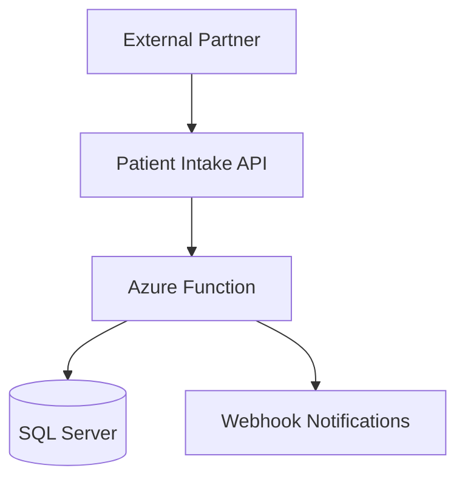

# Scenario 03 - Enterprise Patient Data Exchange Platform

## Project Name

Enterprise Patient Data Exchange Platform

## Architecture Description

A healthcare organization exposes patient integration APIs to external partners using Azure API Management.

Authentication uses OAuth 2.0 Client Credentials and secrets are stored in Azure Key Vault.

Incoming requests are processed through Azure Functions and stored in SQL Server.

Webhook notifications support payload signing but do not currently implement idempotency controls.

The platform includes centralized monitoring and Application Insights logging. Correlation IDs are implemented for API requests but distributed tracing has not been fully adopted.

Retry policies are configured for API failures, however dead-letter queues are not currently implemented.

Environment isolation exists between Development, QA, and Production, but disaster recovery testing has not been formally documented.

Audit logging captures administrative activity and API access events, but PHI access auditing is only partially implemented.

The organization plans to onboard new partners and expand integration capabilities over the next year.

## Mermaid Diagram


## OpenAPI Spec
```json
{
    "openapi": "3.0.1",
    "info": {
        "title": "Patient Exchange API",
        "version": "1.0"
    },
    "paths": {
        "/patients": {
            "post": {
                "summary": "Create patient",
                "responses": {
                    "202": {
                        "description": "Accepted"
                    }
                }
            }
        }
    }
}
```
## Requirements

The platform must support secure partner onboarding using OAuth 2.0 Client Credentials.

The platform must support patient demographic, insurance, and integration event data.

The platform must protect PHI in transit and at rest.

The platform must provide auditability for API access, administrative actions, and PHI access.

The platform must support API versioning and backward - compatible partner integrations.

Webhook notifications must support payload signing and verification.

## Expected Review Outcome

### Overall Assessment

| Metric | Expected Value |
|----------|----------|
| Overall Risk | Medium |
| Architecture Health Score | 40-45% |
| Architecture Health | At Risk |